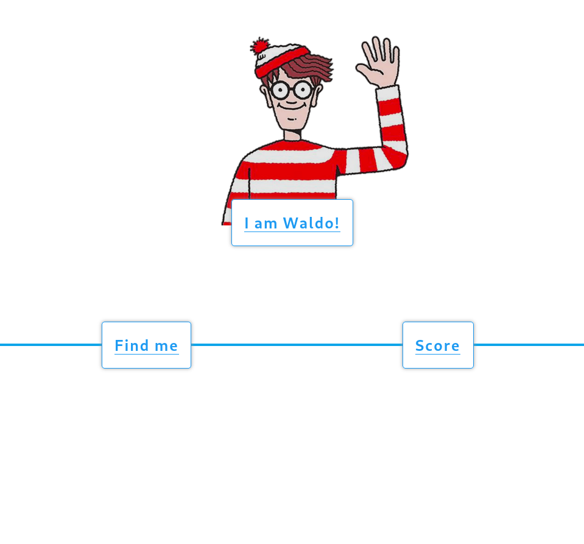
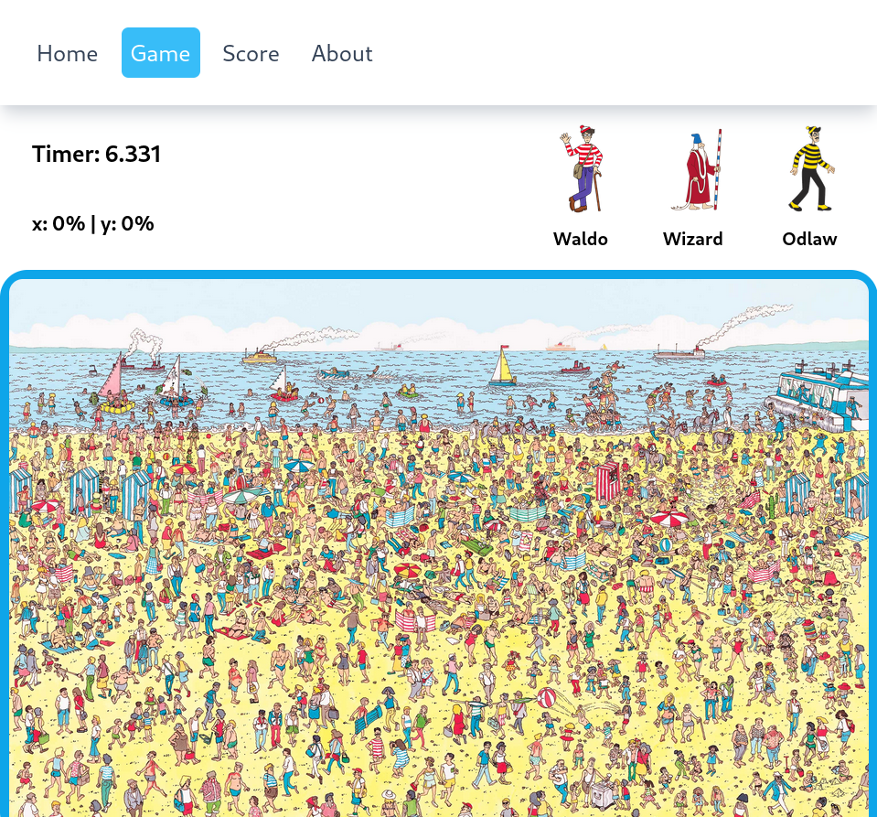
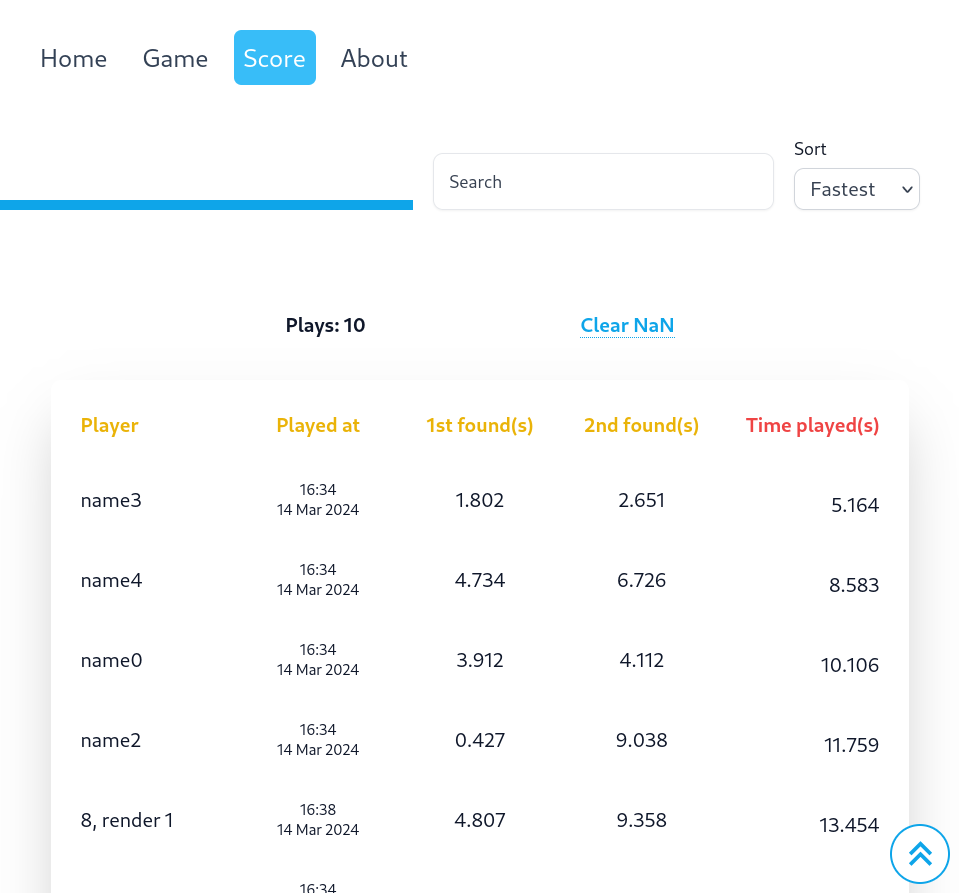

# Where's Waldo Frontend

The **Where's Waldo Front** is created according to the assignment from **The Odin Project** [course](https://www.theodinproject.com/lessons/nodejs-where-s-waldo-a-photo-tagging-app)
<br>
<br>

## 🔗 **Live demo** of the project is [here](https://whereswaldotop.vercel.app/).

## 🔗 **API hosting** of the project is [here](https://whereswaldotop.glitch.me/).

## **Features**

- Handle loading and error data fetching states properly
- Fully responsive
  <!-- - Beautiful UI ^^ -->
  Quick note:
- odlaw x: 10% - y: 35%
- wizard x: 26% - y: 34%
- waldo x: 61% - y: 37%

## **Outcome**

- Used **React Router Dom**
- Used **Tailwindcss**
- Used **Vite**

## **Getting Started**

```bash
HTTPS - git clone https://github.com/minhhoccode111/wheres-waldo-front.git

SSH - git clone git@github.com:minhhoccode111/wheres-waldo-front.git

cd wheres-waldo-front

npm install

npm start
```

## **Idea to implement**

- Some animations
- Light, dark themes
- Search, sort score board

## **Navigation**

- See [all my projects'](https://github.com/minhhoccode111/all-projects-live-demos) live demos

* See my previous project [Blog API](https://github.com/minhhoccode111/personal-portfolio)

* See this project backend [Where's Waldo Back](https://github.com/minhhoccode111/wheres-waldo-back)

<!-- * See my next project []() -->

## **Project preview**

Home


Game play


Score board

